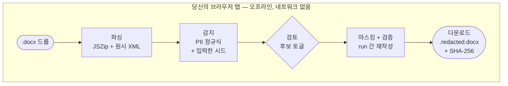

# document-redactor

[](https://github.com/kipeum86/document-redactor/actions/workflows/ci.yml)
[](https://github.com/kipeum86/document-redactor/releases)
[](LICENSE)
[](https://github.com/kipeum86/document-redactor/releases)
[](#신뢰의-구조--네트워크-없음의-4단-방어)
[](#이-도구가-무엇이고-무엇이-아닌지)

[](README.md)

─────────────────────────────────────────────────────────────

## 이 도구가 해결하는 문제

계약서 하나 — 혹은 의견서, 준비서면, 메모, 판결문 — 를 ChatGPT나 Claude, Perplexity 같은 AI에 넣어서 요약·조항 검토·리스크 플래그를 부탁하고 싶은 순간이 있습니다. 그런데 그 문서에는 **회사명, 상대방 정보, 전화번호, 주민등록번호, 계좌번호, 사건번호** 가 들어있습니다. 그대로 올릴 수는 없습니다.

그래서 매번:

1. 파일을 Word로 열고
2. 민감한 문자열을 **수동으로 지우거나 `Ctrl+H`로 찾아 바꾸고**
3. 혹시 놓친 게 없나 화면을 뚫어지게 보고
4. 두 손 모아 업로드합니다

**`document-redactor` 는 이 과정을 한 번의 클릭으로 끝내줍니다.** 파일을 드롭하고, 감지된 후보를 검토하고, Apply를 누르고, 마스킹된 사본을 다운로드하세요. 인터넷 연결도, 파일 설치도, 터미널도, 계정 등록도, 업로드도 필요 없습니다 — 다운로드 받은 도구 자체가 중간에 변조되지 않았는지 확인할 수 있는 해시 검증까지 기본으로 포함되어 있습니다.

HTML 한 파일, 약 180 KB, 브라우저에서 오프라인으로 실행.

─────────────────────────────────────────────────────────────

## What it is, what it isn't

| ✅ What it is | ❌ What it isn't |
|---|---|
| 브라우저에서 실행되는 오프라인 도구 | 클라우드 서비스 |
| 한 번만 받으면 끝인 단일 HTML 파일 (약 180 KB) | 설치 프로그램이나 네이티브 앱 |
| 규칙 기반의 결정론적(deterministic) 마스킹 도구 | AI 모델 — 모델도, LLM도, "마법"도 없음 |
| 전체 소스를 직접 읽고 감사할 수 있는 도구 | 무조건 믿어야 하는 블랙박스 |
| Apache 2.0 라이선스라 본인 혹은 본인의 AI 어시스턴트가 전체를 감사할 수 있음 | 숨겨진 동작이 있는 독점 소프트웨어 |

누군가 "이거 뒤에서 ChatGPT 쓰는 거 아냐?" 또는 "파일을 어딘가로 보내서 처리하겠지"라고 말한다면 — 가장 간단한 검증 방법이 있습니다. **비행기 모드를 켜고, WiFi를 끊고, 이더넷 케이블을 뽑으세요.** 그 상태에서 도구를 열고 실제 문서로 마스킹을 돌려보세요. 전부 정상 작동합니다. 드롭 영역이 파일을 받고, 후보가 감지되고, 마스킹이 실행되고, 결과물 다운로드까지 멀쩡히 됩니다. 인터넷이 필요한 도구라면 이 시점에 멈췄을 겁니다 — 이 도구는 멈추지 않습니다. 애초에 인터넷과 통신할 수 있는 경로 자체가 없기 때문입니다.

─────────────────────────────────────────────────────────────

## 빠른 시작

1. **다운로드** — 최신 릴리즈에서 두 파일을 받습니다:
   - [`document-redactor.html`](https://github.com/kipeum86/document-redactor/releases/latest/download/document-redactor.html) (도구 자체, 파일 하나)
   - [`document-redactor.html.sha256`](https://github.com/kipeum86/document-redactor/releases/latest/download/document-redactor.html.sha256) (무결성 검증용 사이드카 파일)

2. **검증** — 받은 파일이 공개된 원본과 일치하는지 확인합니다:

   ```bash
   sha256sum -c document-redactor.html.sha256
   # 기대 출력:
   #   document-redactor.html: OK
   ```

   `OK` 가 뜨면 파일이 작성자가 배포한 것과 바이트 단위로 완전히 같다는 뜻입니다. 다른 결과가 나오면 **거기서 멈추세요** — GitHub과 당신 사이 어딘가에서 누군가 파일을 바꿔치기했다는 신호입니다. 실행하지 마세요.

3. **열기.** HTML 파일을 더블클릭합니다. 기본 브라우저에서 `file://` URL로 열립니다. 설치 단계 없음, 권한 요청 없음, 네트워크 호출 없음. 그 자리에서 로드된 페이지가 도구의 전부입니다.

4. **사용.** `.docx` 파일을 드롭 영역에 끌어다 놓습니다. 오른쪽 패널에서 감지된 후보들을 검토합니다. **Apply and verify** 를 누르거나 ⌘/Ctrl + Enter를 누릅니다. `{원본이름}.redacted.docx` 로 마스킹된 결과물이 다운로드됩니다.

후보 검토 방식, 단축키, 문제 해결, 계약서가 아닌 문서(의견서, 준비서면, 메모 등)에서의 사용법까지 다룬 자세한 가이드는 **[USAGE.ko.md](USAGE.ko.md)** (한글) 또는 **[USAGE.md](USAGE.md)** (영문) 를 참고하세요.

─────────────────────────────────────────────────────────────

## 왜 파일이 두 개인가요? (`.sha256` 사이드카)

모든 릴리즈는 **두 개의 파일**을 포함합니다 — 도구 본체와, 확장자가 `.sha256` 인 작은 텍스트 파일. 이유를 설명하면 다음과 같습니다.

당신이 도구를 다운로드한 뒤 동료에게 카카오톡, 이메일, USB로 전달한다고 해봅시다. 당신과 동료 사이 어딘가에서 파일은 다음을 거쳐갑니다:

- **회사 프록시와 DLP 시스템** — 첨부 파일을 조용히 다시 쓰는 경우가 있음
- **이메일 게이트웨이** — MIME 인코딩을 변경할 수 있음
- **메신저 앱** — 파일을 재압축하거나 변환할 수 있음
- **악의적인 네트워크 중간자** — 고전적인 "man in the middle" 공격 시나리오

이 중 어느 것이든 조용히 파일을 바꿀 수 있습니다 — 단 1 바이트만 바뀌어도 — 받은 사람은 알아차릴 방법이 없습니다. 감사된 그대로 실행되어야 하는 법률 도구에서는 받아들일 수 없는 상황입니다.

`.sha256` 사이드카가 해결책입니다. 이 파일에는 원본 HTML 파일의 **64자 길이 암호학적 지문**이 들어 있습니다. 받은 사람은 한 줄짜리 명령만 실행하면 됩니다:

```bash
sha256sum -c document-redactor.html.sha256
```

- ✅ 출력이 `document-redactor.html: OK` 이면 — 그 파일은 작성자가 배포한 것과 **바이트 단위로 완전히 동일**합니다. 모든 비트가 일치합니다. 실행해도 안전합니다.
- ❌ 다른 결과가 나온다면 — **작성자와 당신 사이 어딘가에서 파일이 수정**되었다는 뜻입니다. 실행하지 마세요. 공식 릴리즈 페이지에서 다시 받으세요.

**사이드카 자체를 신뢰하지 않아도 됩니다.** 지문은 HTML로부터 수학적으로 파생됩니다 — 두 파일 중 어느 하나라도 한 글자만 바뀌면 검증이 실패합니다. 진짜 신뢰의 기준은 공개된 [GitHub Releases 페이지](https://github.com/kipeum86/document-redactor/releases/latest) 에 올라가 있는 해시입니다. 이 해시는 CI 파이프라인이 태그된 소스 커밋으로부터 빌드해서 공개한 것이고, 누구나 검증할 수 있는 ground truth입니다.

편지 봉투에 찍힌 변조 방지용 밀랍 봉인과 같은 역할이라고 생각하시면 됩니다 — 봉인이 온전하면 편지가 열리지 않았다는 증거입니다. 차이점은 SHA-256 지문은 위조가 불가능하다는 것입니다.

─────────────────────────────────────────────────────────────

## 작동 방식 (간단히)



둥근 모서리는 입/출력(파일 in, 파일 out)입니다. 사각형은 완전 자동화된 단계입니다. 마름모는 사람이 개입하는 유일한 지점입니다 — 감지된 후보를 검토하고 어떤 것을 마스킹할지 직접 토글하는 곳입니다. **서브그래프 안쪽 전체가 당신의 브라우저 탭 안에서만 실행됩니다.** 네트워크 호출 없음, 서버 왕복 없음, 백그라운드 워커 없음. 도구는 `.docx` 를 zip으로 로드하고(Word 파일은 XML들의 zip입니다), 텍스트가 들어있는 모든 scope(본문, 각주, 미주, 댓글, 머리말, 바닥글)를 순회하면서 정규식과 당신의 시드로 후보를 감지합니다. 그다음 당신의 검토 결과에 따라 XML을 제자리에서 재작성하고, 바이트 단위로 재현 가능한 결과물과 그에 매칭되는 SHA-256 해시를 생성합니다.

단계별 가이드는 [USAGE.ko.md](USAGE.ko.md) (한글) 또는 [USAGE.md](USAGE.md) (영문) 를 참고하세요.

─────────────────────────────────────────────────────────────

## 왜 하나의 HTML 파일인가

2026년에 단일 HTML 파일로 도구를 배포한다는 건 흔치 않은 선택입니다. 대부분의 도구는 웹앱, 데스크톱 앱, CLI 중 하나로 출시됩니다. 파일 기반 배포를 선택한 이유는 다음과 같습니다:

1. **구조적으로 오프라인.** 연결할 대상 자체가 없습니다. 파일이 로드되는 순간 도구는 이미 완성 상태입니다. 지연 로드되는 chunk도, CDN도, 폰트 서버도 없습니다. 마스킹 작업 중에 WiFi가 끊겨도 아무것도 달라지지 않습니다.

2. **한 번의 읽기로 감사 가능.** 프로그램 전체가 약 5,000줄의 생성된 JavaScript와 CSS가 파일 하나에 담긴 형태입니다. `cat`으로 출력하거나 `grep`으로 검색하거나, LLM에 통째로 붙여넣고 "여기에 네트워크로 나가는 코드 있어?"라고 물어볼 수도 있습니다. 답은 몇 분 안에 검증 가능합니다.

3. **인프라 없이 배포 가능.** 유지할 서버도, 갱신해야 할 도메인도, 지켜야 할 계정 DB도 없습니다. 이메일로 보내도 되고, USB에 담아서 건네도 되고, 카카오톡으로 공유해도 됩니다. 받는 사람은 `sha256sum` 한 줄로 무결성을 확인합니다.

4. **업데이트 경로 자체가 없음.** 이 도구는 스스로 업데이트할 수 없습니다. 악성 업데이트가 당신에게 도달할 경로가 없다는 뜻입니다. 다운로드한 그 버전이 당신이 실행하는 버전이고, 그게 영구적입니다. 새 버전이 나오면 받을지 말지는 당신이 선택합니다.

트레이드오프는 v1이 서버가 정말 필요한 기능들(팀 협업, 공유 감사 로그, 중앙 집중식 정책 관리)을 지원하지 않는다는 점입니다. 이건 의도적 선택입니다 — 단일 파일 모델은 제약이 아니라 제품의 본질입니다.

─────────────────────────────────────────────────────────────

## 신뢰의 구조 — "네트워크 없음"의 4단 방어

이 도구가 당신의 문서를 들고 몰래 외부로 통신할 수 없어야 한다 — 이것이 약속입니다. 이 약속은 서로 독립적인 네 개의 층위에서 강제됩니다:

| 층위 | 메커니즘 | 검증 방법 |
|---|---|---|
| **소스 코드** | ESLint 룰 `no-restricted-syntax` 가 매 커밋마다 `fetch`, `XMLHttpRequest`, `WebSocket`, `EventSource`, `navigator.sendBeacon`, 동적 `import()` 의 사용 자체를 금지 | 소스 체크아웃 후 `bun run lint` 실행 |
| **번들** | `vite.config.ts` 가 modulepreload 폴리필을 비활성화합니다 (이 폴리필은 동적 chunk 프리로드를 위해 `fetch()` 호출을 주입). 빌드 시점 ship-gate 테스트는 출력 HTML에 `fetch(` 토큰 0개, `XMLHttpRequest` 0개, `new WebSocket` 0개임을 실제 문자열 검색으로 확인 | `grep -c 'fetch(' document-redactor.html` → `0` |
| **런타임** | HTML에 내장된 Content-Security-Policy 메타 태그: `default-src 'none'; connect-src 'none'; ...`. 실행 중인 페이지가 소켓을 열려고 시도하는 순간 브라우저가 탭을 빠져나가기 전에 차단 | 개발자 도구 → Network 탭 열고 → 도구 사용해보기 → 요청 0건인지 확인 |
| **배포** | 모든 릴리즈에 SHA-256 사이드카가 동봉됨. 당신이 다운로드한 도구의 해시는 CI 파이프라인이 해당 태그 커밋에서 빌드한 결과물의 해시와 일치. 커밋 히스토리, 변경 diff, 빌드 로그 전부 GitHub에서 공개 | `sha256sum -c document-redactor.html.sha256` |

각 층위는 독립적입니다. 하나를 뚫어도 나머지 셋이 남아있습니다. 이건 "보안 쇼(security theater)"가 아닙니다 — 코드 레벨의 금지가 도구가 약속대로 동작하게 만드는 실질적 기반이고, CSP는 이론적인 번들 레벨 우회를 차단하는 장치이며, 해시는 배포 과정에서의 중간자 공격(man-in-the-middle)을 방지합니다.

─────────────────────────────────────────────────────────────

## 기술 스택

| 층위 | 선택 | 이유 |
|---|---|---|
| 패키지 매니저 | **Bun 1.x** | 빠른 설치, TypeScript 기본 지원, 추가 도구체인 불필요 |
| 번들러 | **Vite 8** | 현대적 DX, ES 모듈 1급 지원, 단단한 플러그인 생태계 |
| UI 프레임워크 | **Svelte 5** (runes 모드) | 가장 작은 런타임 footprint, 세밀한 반응성, 약 30 KB 오버헤드 |
| 단일 파일 패키징 | **vite-plugin-singlefile** | 모든 JS chunk와 CSS 시트를 HTML에 인라인 |
| DOCX 파싱 + 수정 | **JSZip** + 원시 XML 조작 | 쓰기 전용 라이브러리 사용 안 함 (`docx.js` 는 Gate 0 단계에서 읽기 지원이 없어 탈락) |
| Run 간 텍스트 처리 | 자체 **coalescer** 모듈 | Word는 `<w:t>ABC Corpo</w:t><w:t>ration</w:t>` 처럼 run을 분할합니다. coalescer가 논리적 텍스트 뷰를 재조립하고 매칭을 찾은 뒤, 영향받는 run만 수술적으로 재작성합니다 |
| 해싱 | **Web Crypto SubtleCrypto**(브라우저) + **node:crypto**(빌드) | 플랫폼 프리미티브, 외부 의존성 없음 |
| 테스트 | **Vitest 2** | Vite 네이티브, 빠름, TypeScript 우선. 422 테스트가 약 1.5초 |
| 타입 체크 | **TypeScript 5 strict** + **svelte-check 4** | `strict`, `exactOptionalPropertyTypes`, `noUncheckedIndexedAccess` 전부 활성 |
| 린팅 | **ESLint 9** (flat config) | 커스텀 `no-restricted-syntax` 룰이 소스 레벨에서 "네트워크 없음" 불변식을 강제 |
| CI | **GitHub Actions**, `ubuntu-latest`, Bun | 공개 레포는 무료, 실행당 약 40초 |

**의도적으로 뺀 것들:** React 없음, 웹 프레임워크 없음, CSS-in-JS 런타임 없음, 상태 관리 라이브러리 없음, 날짜 처리 라이브러리 없음, i18n 프레임워크 없음, 애널리틱스 없음, 에러 리포팅 없음, 텔레메트리 없음, 기능 플래그 없음, A/B 테스트 없음, 네트워크로 나가는 lock-file 체크 없음.

─────────────────────────────────────────────────────────────

## 알려진 제한사항

이것들은 버그가 아닙니다 — v1에서 의도적으로 다루지 않은 것들입니다. 대부분 v1.x에서 계획되어 있습니다.

- **v1은 DOCX 전용 — PDF 지원은 추후 업데이트 예정.** 엔진이 Word의 zip-of-XML 구조에 맞춰 설계되어 있습니다. PDF는 완전히 다른 content model(좌표 기반 텍스트 run이 이진 객체 트리에 담긴 형태)이라 별도 파이프라인이 필요합니다. 로드맵에는 있지만 v1에는 없습니다. 당장 필요하면 PDF를 먼저 DOCX로 변환(Word, Google Docs, 혹은 PDF 도구의 내보내기 기능)한 뒤 이 도구에 넣으세요.
- **Level picker는 v1에서 장식용입니다.** **Standard** 룰 세트만 실제로 동작합니다. Conservative와 Paranoid 옵션은 UI 스텁이며, v1.1에서 구현 예정입니다.
- **문서 프리뷰에서 클릭-선택 불가.** 프리뷰 패널은 "후보 검토는 오른쪽 패널에서 진행"이라고 안내하는 자리표시자입니다. 완전한 WordprocessingML → HTML 렌더러는 별도 모듈 규모 작업이라 v1.1 또는 v1.2에서 다룰 예정입니다.
- **View source 버튼은 비활성 상태입니다.** 툴팁으로 안내되어 있습니다. v1.1에서 구현 예정 — self-hash 모달이 실행 중인 파일 자신의 SHA-256을 계산해서 GitHub Release 페이지에 공개된 해시와 비교합니다. 터미널 없이 앱 안에서 "지금 이 탭이 진짜 그 도구인가?" 를 확인할 수 있게 됩니다. 초기 목업에 있던 **Audit log** 버튼은 **로드맵에서 삭제**됐습니다 — 이 도구는 인코그니토, 원샷 사용에 최적화되어 있어서 상태를 남기지 않는 것이 제약이 아니라 오히려 **설계 원칙**입니다.
- **720 px 미만에서는 2컬럼으로 축소됩니다.** 3컬럼 데스크톱 레이아웃을 편하게 쓰려면 ≥1024 px가 필요합니다.
- **OCR 없음.** DOCX 안에 텍스트가 이미지로 들어가 있으면(스캔 PDF를 Word로 가져온 경우 등) 그 이미지 속 텍스트는 처리되지 않습니다. 도구는 텍스트 run을 다루지, 픽셀을 다루지 않습니다. OCR은 로드맵에 없습니다 — 브라우저용 OCR 엔진이 약 10~30 MB라서 단일 파일 배포 모델과 구조적으로 충돌합니다. 별도 OCR 도구(Adobe Acrobat, macOS 미리보기, 한글 등)로 텍스트 레이어를 먼저 만든 뒤 그 결과물을 이 도구에 넣는 방식을 권장합니다.
- **임베디드 객체 내부는 순회하지 않음.** OLE로 임베디드된 Excel/PowerPoint 객체 안으로는 들어가지 않습니다. 네이티브 DOCX 표의 셀은 **정상적으로 처리됩니다**.
- **SmartArt, WordArt 텍스트는 처리하지 않음.** 이것들은 v1 범위 밖의 특수 OOXML 구조입니다.
- **주로 이중언어 계약서로 테스트됨.** 엔진은 텍스트 기반이라 어떤 DOCX에도 동작하지만, v1의 fixture corpus는 계약서 중심입니다. 의견서, 준비서면, 메모, 내부 노트 모두 실전에서 잘 동작합니다 — 사용 가이드는 [USAGE.ko.md](USAGE.ko.md#7-계약서가-아닌-문서) (한글) 또는 [USAGE.md](USAGE.md#non-contract-documents) (영문) 를 참고하세요.

─────────────────────────────────────────────────────────────

## 개발자를 위한 정보

```bash
git clone https://github.com/kipeum86/document-redactor.git
cd document-redactor
bun install
bun run dev         # Vite 개발 서버, 127.0.0.1:5173
bun run test        # 422 tests, 약 1.5초
bun run typecheck   # tsc --noEmit + svelte-check
bun run lint        # ESLint ("네트워크 없음" 불변식 강제)
bun run build       # dist/document-redactor.html + .sha256 생성
```

테스트 스위트는 ship-gate 체크의 일부로 실제 `vite build`를 실행합니다. 그래서 `bun run test` 하나가 엔진, UI 로직, 프로덕션 빌드를 전부 end-to-end로 검증하는 가장 포괄적인 단일 명령입니다.

소스 레이아웃:

```
src/
├── detection/      PII 정규식 스윕 + 키워드 제안기
├── docx/           DOCX I/O: coalescer, scope walker, redactor, verifier
├── finalize/       SHA-256 + 단어 수 정합성 + ship-gate 오케스트레이터
├── propagation/    변형 전파 + 정의된 용어(defined term) 분류기
└── ui/             Svelte 5 컴포넌트 + 상태 머신 + 엔진 래퍼
```

─────────────────────────────────────────────────────────────

## 영감

[Tan Sze Yao의 Offline-Redactor](https://thegreatsze.github.io/Offline-Redactor/) 에서 영감을 받았습니다.

─────────────────────────────────────────────────────────────

## 라이선스

[Apache License 2.0](LICENSE). 사용, 수정, 재배포, 판매 모두 가능합니다 — LICENSE 파일의 조건(특허 허여 포함, 저작권·귀속 고지 유지 의무 포함)을 따라야 합니다.

─────────────────────────────────────────────────────────────

_[@kipeum86](https://github.com/kipeum86) 이 만들었습니다._
