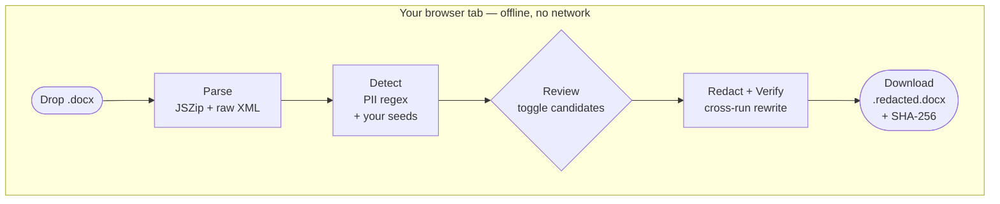

# document-redactor

[](https://github.com/kipeum86/document-redactor/actions/workflows/ci.yml)
[](https://github.com/kipeum86/document-redactor/releases)
[](LICENSE)
[](https://github.com/kipeum86/document-redactor/releases)
[](#the-trust-story--four-layers-of-no-network)
[](#what-it-is-what-it-isnt)

[](README.ko.md)

─────────────────────────────────────────────────────────────

## The problem this solves

You want to run a contract — or an opinion, a brief, a memo, a judge's order — through ChatGPT, Claude, Perplexity, or any other LLM for a summary, a clause review, or a quick legal risk check. But the document has **company names, counterparty details, phone numbers, 주민등록번호, account numbers, case numbers**. You can't just upload it.

So every single time, you:

1. Open the file in Word
2. Manually delete, or `Ctrl+H` search-and-replace, every sensitive string
3. Squint at the screen hoping nothing was missed
4. Cross your fingers and paste

**`document-redactor` does all of that in one click.** Drop the file. Review what the tool found. Press Apply. Download the redacted copy. No internet connection, no installation, no terminal, no account, no upload — and a hash check on the download so you know the tool itself hasn't been tampered with on its way to you.

One HTML file, ~180 KB, runs in your browser, offline, from your disk.

─────────────────────────────────────────────────────────────

## What it is, what it isn't

| ✅ What it is | ❌ What it isn't |
|---|---|
| An offline tool that runs in your browser | A cloud service |
| One HTML file (~180 KB) you download once | An installer or a native app |
| A rule-based, deterministic redactor | An AI model — there is no model, no LLM, no "magic" |
| A tool whose full source you can read and audit yourself | A black box you have to trust |
| Apache 2.0-licensed, reviewable by you or your AI assistant | Proprietary software with hidden behavior |

If someone tells you this tool "probably uses ChatGPT" or "sends your files somewhere for processing," here's the simplest test you can run yourself: **turn on airplane mode. Disconnect your WiFi. Unplug the ethernet cable.** Then open the tool and use it on a real document. Everything still works. The drop zone accepts your file, candidates get detected, redaction runs, the download button saves the output. A tool that needed the internet to function would fail at this point — this one doesn't, because it has no way to talk to the internet in the first place.

─────────────────────────────────────────────────────────────

## Quick start

1. **Download** the latest release:
   - [`document-redactor.html`](https://github.com/kipeum86/document-redactor/releases/latest/download/document-redactor.html) (the tool itself, one file)
   - [`document-redactor.html.sha256`](https://github.com/kipeum86/document-redactor/releases/latest/download/document-redactor.html.sha256) (integrity sidecar)

2. **Verify** the download matches what was published:

   ```bash
   sha256sum -c document-redactor.html.sha256
   # expected output:
   #   document-redactor.html: OK
   ```

   If you see `OK`, the file is byte-identical to what the author shipped. If you see anything else, **stop** — something between you and GitHub modified the file. Do not run it.

3. **Open it.** Double-click the HTML file. It opens in your default browser as a `file://` URL. There is no install step, no permissions prompt, no network call. The page that loads is the whole tool.

4. **Use it.** Drop a `.docx` file onto the drop zone. Review the detected candidates in the right panel. Click **Apply and verify** (or press ⌘/Ctrl + Enter). Download the redacted file as `{yourfile}.redacted.docx`.

For a detailed walkthrough — including the candidate review model, keyboard shortcuts, troubleshooting, and how to handle non-contract documents (opinions, briefs, memos) — see **[USAGE.md](USAGE.md)**.

─────────────────────────────────────────────────────────────

## Why two files? (The `.sha256` sidecar)

Every release ships **two** files: the tool itself and a tiny text file ending in `.sha256`. Here's why.

Imagine you download the tool and then forward it to a colleague via Kakao, email, or a USB stick. Somewhere between you and them, the file passes through:

- **Corporate proxies and DLP systems** that sometimes rewrite attachments
- **Email gateways** that can modify MIME encodings
- **Messaging apps** that re-compress or transcode files
- **Malicious network intermediaries** (the classic "man in the middle" scenario)

Any of these could quietly change the file — even a single byte — and your colleague would have no way to notice. For a legal tool that must run exactly as audited, that's unacceptable.

The `.sha256` sidecar is the solution. It contains a 64-character **cryptographic fingerprint** of the original HTML file. Your colleague runs one command:

```bash
sha256sum -c document-redactor.html.sha256
```

- ✅ If the output says `document-redactor.html: OK` — the file is **byte-for-byte identical** to what the author published. Every bit matches. Safe to run.
- ❌ If the output says anything else — **something between the author and them modified the file**. Do not run it. Re-download from the official releases page.

**The sidecar is not a signature you have to trust the sidecar itself.** The fingerprint is mathematically derived from the HTML — changing either file by one character makes the check fail. The hash that matters is the one on the official [GitHub Releases page](https://github.com/kipeum86/document-redactor/releases/latest), publicly visible, built by CI from the tagged source commit. That's the ground truth.

Think of it as a tamper-evident seal on an envelope: if the seal is intact, the letter inside hasn't been opened. The difference is that SHA-256 fingerprints cannot be forged.

─────────────────────────────────────────────────────────────

## How it works (briefly)



Rounded caps are I/O (file in, file out). Rectangles are fully automated steps. The diamond is the one place a human decides anything — you review the detected candidates and toggle which ones to redact. **Everything inside the subgraph runs in your browser tab.** No network call, no server round-trip, no background worker. The tool loads the `.docx` as a zip (Word files are zips of XML), walks every text-bearing scope (body, footnotes, endnotes, comments, headers, footers), detects candidates via regex + your seeds, lets you review and toggle, then rewrites the XML in place and generates a byte-stable output with a matching SHA-256 hash.

See [USAGE.md](USAGE.md) for the step-by-step guide.

─────────────────────────────────────────────────────────────

## Why a single HTML file

One HTML file is an unusual choice in 2026. Most tools ship as web apps, desktop apps, or CLIs. Here's the case for file-based distribution:

1. **Offline by construction.** There's nothing to connect to. The moment the file loads, the tool is complete. No lazy-loaded chunks, no CDN, no font server. If your WiFi dies mid-redaction, nothing changes.

2. **Auditable in a single read.** The whole program is ~5,000 lines of generated JavaScript and CSS in one file. You can `cat` it, `grep` it, or paste it into an LLM and ask "is there anything in here that talks to the network?" The answer is verifiable in minutes.

3. **Distributable without infrastructure.** No server to maintain, no domain to renew, no account database to protect. You can email it, put it on a USB stick, share it over Kakao. Recipients verify integrity with `sha256sum`.

4. **No update surface.** The tool cannot update itself. A malicious update cannot reach you. The version you downloaded is the version you run, forever. When a new version ships, you choose whether to download it.

The trade-off is that v1 does not support features that genuinely need a server (team collaboration, shared audit logs, central policy enforcement). That's a deliberate choice — the single-file model is the product, not a limitation.

─────────────────────────────────────────────────────────────

## The trust story — four layers of "no network"

The promise is that this tool cannot phone home with your documents. That promise is enforced at four independent layers:

| Layer | Mechanism | How you verify |
|---|---|---|
| **Source code** | ESLint rule `no-restricted-syntax` bans `fetch`, `XMLHttpRequest`, `WebSocket`, `EventSource`, `navigator.sendBeacon`, and dynamic `import()` at every commit | `bun run lint` on a checkout of the source |
| **Bundle** | `vite.config.ts` disables the modulepreload polyfill (which would otherwise inject a `fetch()` call). Build-time ship-gate test asserts zero `fetch(` tokens, zero `XMLHttpRequest`, zero `new WebSocket` in the output HTML | `grep -c 'fetch(' document-redactor.html` → `0` |
| **Runtime** | Embedded Content-Security-Policy meta tag: `default-src 'none'; connect-src 'none'; ...`. Any attempt by the running page to open a socket is blocked by the browser before it leaves the tab | Open DevTools → Network tab → try to use the tool → observe zero requests |
| **Distribution** | Every release ships with a SHA-256 sidecar. The tool you download has a hash matching what the CI pipeline built from the tagged commit. History, diffs, and build logs are public on GitHub | `sha256sum -c document-redactor.html.sha256` |

Each layer is independent. Defeating one still leaves three in place. This is not "security theater" — the actual code-level bans are what make the tool behave as promised; the CSP is what stops a theoretical bundle-level bypass; the hash is what prevents man-in-the-middle substitution during distribution.

─────────────────────────────────────────────────────────────

## Tech stack

| Layer | Choice | Why |
|---|---|---|
| Package manager | **Bun 1.x** | Fast install, built-in TypeScript, no extra toolchain |
| Bundler | **Vite 8** | Modern DX, first-class ES modules, tight plugin ecosystem |
| UI framework | **Svelte 5** (runes mode) | Smallest runtime footprint, fine-grained reactivity, ~30 KB overhead |
| Single-file packaging | **vite-plugin-singlefile** | Inlines every JS chunk and CSS sheet into the HTML |
| DOCX parsing + mutation | **JSZip** + raw XML manipulation | No write-only libraries (`docx.js` was rejected at Gate 0 — write-only API) |
| Cross-run text handling | Custom **coalescer** module | Word splits runs like `<w:t>ABC Corpo</w:t><w:t>ration</w:t>`; the coalescer reassembles a logical text view, finds matches, then surgically rewrites only the affected runs |
| Hashing | **Web Crypto SubtleCrypto** (browser) + **node:crypto** (build) | Platform primitives, no dependencies |
| Testing | **Vitest 2** | Vite-native, fast, TypeScript-first. 422 tests in ~1.5 seconds |
| Type checking | **TypeScript 5 strict** + **svelte-check 4** | `strict`, `exactOptionalPropertyTypes`, `noUncheckedIndexedAccess` |
| Linting | **ESLint 9** (flat config) | Custom `no-restricted-syntax` rules enforce the "no network" invariant at the source level |
| CI | **GitHub Actions** on `ubuntu-latest` with Bun | Free for public repos, ~40 seconds per run |

**What's deliberately absent:** no React, no web framework, no CSS-in-JS runtime, no state management library, no date-handling library, no i18n framework, no analytics, no error reporting, no telemetry, no feature flags, no A/B testing, no package lock-file checks that call out to the network.

─────────────────────────────────────────────────────────────

## Known limitations

These are not bugs — they are things v1 deliberately does not do. Most are planned for v1.x.

- **DOCX only in v1 — PDF support is planned for a future update.** The engine is built around Word's zip-of-XML structure. PDF uses an entirely different content model (coordinate-based text runs in a binary object tree), so it needs its own pipeline. It's on the roadmap, not in v1. For now, convert PDFs to DOCX first (Word, Google Docs, or your PDF tool's export feature) and run the result through this tool.
- **Level picker is cosmetic in v1.** Only the **Standard** rule set runs. The Conservative and Paranoid options are UI stubs. Planned for v1.1.
- **No click-to-select in the document preview.** The preview pane is a placeholder explaining that candidate review happens in the right panel. A full WordprocessingML → HTML renderer is a separate module-scale effort planned for v1.1 or v1.2.
- **View source button is disabled.** A tooltip explains why. Planned for v1.1 — the self-hash modal will compute the running file's own SHA-256 and compare it against the hash published on the GitHub Release page, giving you in-app confirmation that the tab you're looking at is the real tool. The sibling **Audit log** button from the early mocks has been **removed from the roadmap** — this tool is designed for incognito, one-shot use where leaving no state is a feature, not a limitation.
- **Layout degrades to 2-column below 720 px.** The 3-column desktop layout needs ≥1024 px to feel comfortable.
- **No OCR.** If your DOCX contains images of text (scanned PDFs imported to Word), the text inside those images is not processed. The tool handles text runs, not pixels. OCR is not on the roadmap — browser-based OCR engines are ~10–30 MB, which would break the single-file distribution model. Use a separate OCR tool first (Adobe Acrobat, macOS Preview, 한글, etc.) to extract a text layer, then run the result here.
- **No embedded object traversal.** OLE-embedded Excel/PowerPoint objects are not walked into. Table cells in native DOCX tables **are** handled.
- **No SmartArt or WordArt text.** These are special OOXML constructs outside v1's scope.
- **Tested primarily against bilingual contracts.** The engine is text-based and works on any DOCX, but v1's fixture corpus is contract-focused. Opinions, briefs, memos, and internal notes all work in practice — see [USAGE.md](USAGE.md#non-contract-documents) for guidance.

─────────────────────────────────────────────────────────────

## For developers

```bash
git clone https://github.com/kipeum86/document-redactor.git
cd document-redactor
bun install
bun run dev         # Vite dev server on 127.0.0.1:5173
bun run test        # 422 tests, ~1.5s
bun run typecheck   # tsc --noEmit + svelte-check
bun run lint        # ESLint (enforces the no-network invariant)
bun run build       # Produces dist/document-redactor.html + .sha256
```

The test suite runs a real `vite build` as part of the ship-gate check, so `bun run test` is the most comprehensive single command — it exercises the engine, the UI logic, and the production build end-to-end.

Source layout:

```
src/
├── detection/      PII regex sweep + keyword suggester
├── docx/           DOCX I/O: coalescer, scope walker, redactor, verifier
├── finalize/       SHA-256 + word-count sanity + ship-gate orchestrator
├── propagation/    Variant propagation + defined-term classifier
└── ui/             Svelte 5 components + state machine + engine wrapper
```

─────────────────────────────────────────────────────────────

## Inspiration

Inspired by [Tan Sze Yao's Offline-Redactor](https://thegreatsze.github.io/Offline-Redactor/).

─────────────────────────────────────────────────────────────

## License

[Apache License 2.0](LICENSE). Use it, modify it, redistribute it, sell it — subject to the terms in the LICENSE file, which include a patent grant and require retaining the copyright and attribution notices.

─────────────────────────────────────────────────────────────

_Built by [@kipeum86](https://github.com/kipeum86)._
